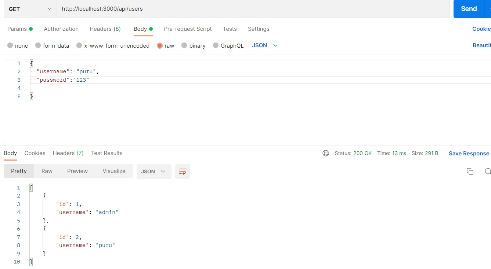
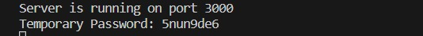
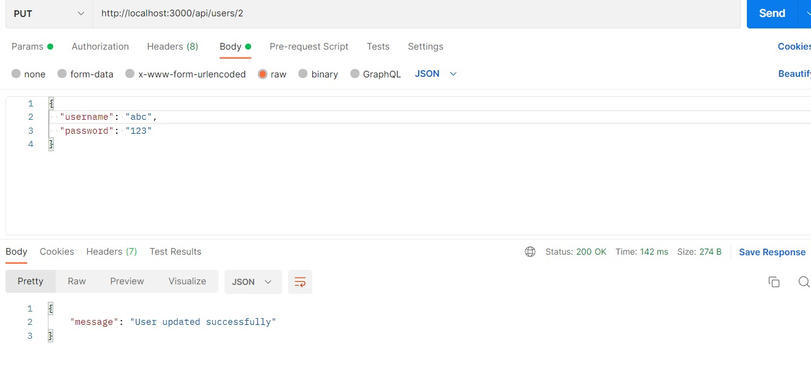
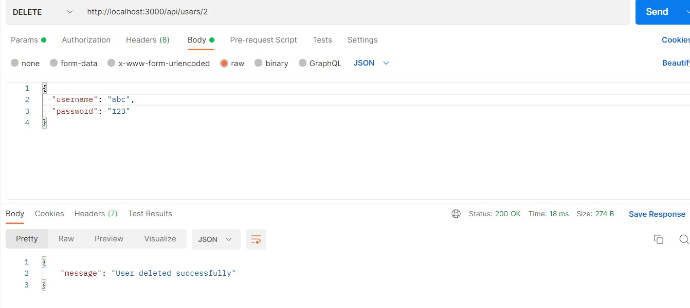

# User-management-REST-API

## 1. Clone the repository:
git clone copy url

## 2. Install dependencies:
a. Navigate to the project directory 
b. Run the following command to install the required packages: 
npm install

## 3. Run server
node server.js

## 4. API requests/testing using Postman 

a. Create User

b. Show all users

c. Login using username and password

d. forgot password(by sending temporary password)

sent temporary password

e. Update username or password

f. Delete user

